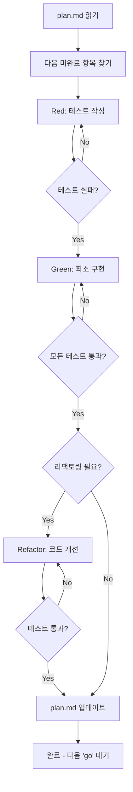

# TDD Go - 다음 테스트 구현

CLAUDE.md의 TDD 원칙을 따라 다음 단계를 실행하세요.

## 실행 단계

### 1. plan.md 확인
- plan.md를 읽고 다음 미완료(unmarked) 테스트 항목 찾기
- 해당 항목을 현재 작업으로 표시

### 2. Red - 실패하는 테스트 작성
```
당신은 시니어 TDD 전문가입니다. 다음 원칙을 따르세요:

1. **의미있는 테스트 이름 작성**
   - 동작을 설명하는 이름 사용
   - 예: shouldReturnUserWhenValidIdProvided
   - 예: shouldThrowErrorWhenEmailIsInvalid

2. **명확한 실패 메시지**
   - 무엇이 잘못되었는지 즉시 알 수 있도록
   - 기대값과 실제값 명시

3. **작은 단위로 테스트**
   - 한 번에 하나의 동작만 테스트
   - 테스트가 실패하는지 확인
```

### 3. Green - 최소 구현
```
테스트를 통과시키는 **최소한의 코드**만 작성하세요:

1. **No More, No Less**
   - 테스트를 통과시키는 가장 간단한 코드
   - 미래를 예측하지 말고 현재 테스트만 통과

2. **모든 테스트 실행**
   - 새 테스트뿐만 아니라 모든 기존 테스트 실행
   - 회귀(regression) 확인

3. **Green 확인**
   - 모든 테스트가 통과해야 다음 단계 진행
   - 실패 시 코드 수정 후 재실행
```

### 4. Refactor - 코드 개선 (선택적)
```
테스트가 모두 통과한 후에만 리팩토링:

1. **중복 제거**
   - DRY 원칙 적용
   - 반복되는 코드 추상화

2. **의도 명확화**
   - 변수명, 함수명 개선
   - 복잡한 로직 분리

3. **각 단계마다 테스트**
   - 리팩토링 한 단계 → 테스트 실행
   - Green 유지 확인
```

### 5. 진행 상황 업데이트
```
plan.md에서 완료된 항목 체크:
- [ ] 항목 → [x] 항목
```

## 자동화 흐름



## Agent 활용

적절한 Agent를 자동으로 호출하세요:

- **testing-expert**: 테스트 전략 및 작성
- **nextjs-expert**: Next.js 관련 구현
- **backend-architect**: API 및 서버 로직
- **frontend-developer**: UI 컴포넌트
- **code-reviewer**: 코드 품질 검토

## 품질 체크리스트

작업 완료 전 확인:

- [ ] 테스트 이름이 동작을 명확히 설명하는가?
- [ ] 테스트가 실패했다가 통과했는가? (Red → Green)
- [ ] 최소한의 코드로 구현했는가?
- [ ] 모든 기존 테스트가 여전히 통과하는가?
- [ ] 리팩토링 후 테스트가 여전히 통과하는가?
- [ ] plan.md가 업데이트되었는가?
- [ ] 코드에 경고(warning)가 없는가?

## 예제

### plan.md 항목:
```markdown
- [ ] 사용자 로그인 기능
  - [ ] 유효한 이메일/비밀번호로 로그인 성공
  - [ ] 잘못된 비밀번호로 로그인 실패
  - [ ] 존재하지 않는 이메일로 로그인 실패
```

### 실행:
1. "유효한 이메일/비밀번호로 로그인 성공" 테스트 작성 (Red)
2. login 함수 최소 구현 (Green)
3. 테스트 통과 확인
4. 필요시 리팩토링 (Refactor)
5. plan.md 업데이트:
```markdown
- [ ] 사용자 로그인 기능
  - [x] 유효한 이메일/비밀번호로 로그인 성공
  - [ ] 잘못된 비밀번호로 로그인 실패
  - [ ] 존재하지 않는 이메일로 로그인 실패
```

## 중요 원칙

> "Write one test at a time, make it run, then improve structure."

- 한 번에 하나의 테스트만
- 작은 단계로 진행
- 항상 Green 상태 유지
- 자주 테스트 실행

---

**이제 plan.md에서 다음 미완료 테스트를 찾아 Red → Green → Refactor 사이클을 시작하세요!**
